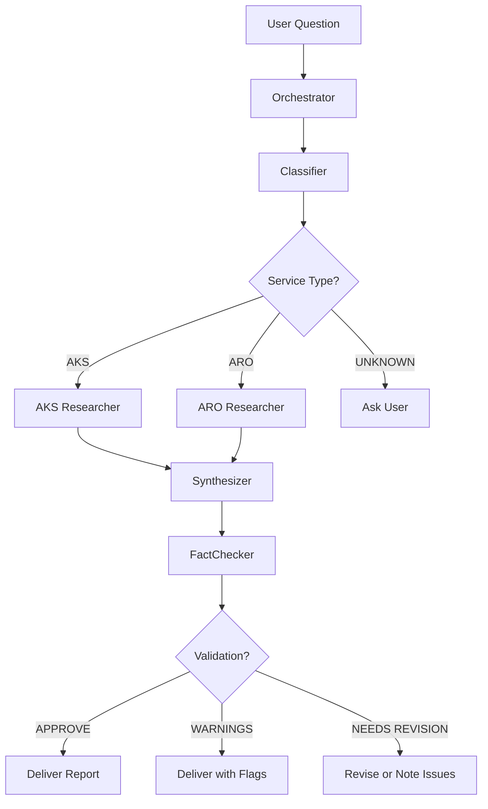

# Nighthawk Agent Architecture

This document explains the orchestrated agent architecture for Nighthawk research workflow.

## Overview

Nighthawk uses an **orchestration framework** architecture with six specialized agents that work together to produce comprehensive, fact-checked technical reports about Azure Kubernetes Service (AKS) and Azure Red Hat OpenShift (ARO).

## Architecture Pattern

**Problem Type**: Workflow-shaped (multi-step pipeline with different capabilities at each stage)

**Quality Gate**: Automated fact-checking by a second LLM + human review

**Governing Principle**: "Design the handoffs first" — each stage has clear input/output contracts

## Agents

### 1. Nighthawk-Orchestrator
**Role**: Main entry point and workflow coordinator

**Tools**: `read`, `search`, `agent`

**Responsibilities**:
- Routes user questions through the complete workflow
- Calls specialized agents via `runSubagent`
- Manages handoffs between stages
- Presents final output to user

**Usage**: `/Nighthawk <your question>`

---

### 2. Nighthawk-Classifier
**Role**: Question classification and keyword extraction

**Tools**: `read`, `search` (no web, no edit, no terminal)

**Responsibilities**:
- Determines if question is AKS, ARO, or UNKNOWN
- Extracts technical keywords for research
- Provides confidence level and reasoning

**Output Format**:
```
SERVICE: AKS|ARO|UNKNOWN
CONFIDENCE: high|medium|low
KEYWORDS: [comma-separated terms]
REASONING: [one sentence]
```

---

### 3. Nighthawk-AKS-Researcher
**Role**: Deep technical research for AKS questions

**Tools**: `read`, `search`, `web`, `microsoftdocs/mcp/*`, `execute/runInTerminal`, `read/terminalLastCommand`

**Responsibilities**:
- Clones/updates AKS-related GitHub repositories
- Searches source code for implementation details
- Queries Microsoft Learn via MCP
- Documents findings with precise source citations

**Repositories**:
- Azure/AKS
- Azure/AgentBaker
- kubernetes-sigs/cloud-provider-azure
- Azure/azure-cli
- Azure/azure-cli-extensions

**Output Format**:
```markdown
## FINDINGS
- [Finding]: Description (source: path/url)

## SOURCES
- GitHub URLs, Microsoft Learn articles

## RAW RESEARCH NOTES
[Detailed analysis]
```

---

### 4. Nighthawk-ARO-Researcher
**Role**: Deep technical research for ARO questions

**Tools**: `read`, `search`, `web`, `microsoftdocs/mcp/*`, `execute/runInTerminal`, `read/terminalLastCommand`

**Responsibilities**:
- Clones/updates ARO-related GitHub repositories
- Searches ARO-RP source code
- Queries Microsoft Learn and ARO roadmap
- Documents findings with precise source citations

**Repositories**:
- Azure/ARO-RP
- Azure/azure-cli

**Output Format**: Same as AKS-Researcher

---

### 5. Nighthawk-Synthesizer
**Role**: Transform research into polished reports

**Tools**: `read`, `edit`, `search` (no web, prevents new research)

**Responsibilities**:
- Creates comprehensive markdown reports
- Structures content with headings and sections
- Generates Mermaid diagrams for complex concepts
- Maintains strict source citation discipline
- Saves report to `notes/Nighthawk-YYYY-MM-DD-<topic>.md`

**Key Constraint**: Works ONLY with provided research — no speculation, no new research

**Output Format**:
```markdown
## SYNTHESIS COMPLETE
**File**: notes/Nighthawk-...
**Word count**: ~XXX
**Diagrams**: X
**Sources cited**: X
```

---

### 6. Nighthawk-FactChecker
**Role**: Validate reports against sources

**Tools**: `read`, `search`, `web`, `microsoftdocs/mcp/*` (no edit)

**Responsibilities**:
- Extracts all technical claims from report
- Verifies each claim against cited sources
- Checks GitHub links (file paths, line numbers)
- Validates documentation references
- Categorizes claims: Verified ✓ / Needs Clarification ⚠ / Unverified ✗ / Incorrect ❌

**Output Format**:
```markdown
## FACT-CHECK SUMMARY
**Total claims**: X
- ✓ Verified: X
- ⚠ Needs clarification: X
- ✗ Unverified: X
- ❌ Incorrect: X

**Recommendation**: APPROVE|APPROVE WITH WARNINGS|NEEDS REVISION

## DETAILED VALIDATION
[Per-claim analysis]

## SUGGESTED CORRECTIONS
[Specific fixes needed]
```

---

## Workflow Stages



## Data Contracts

### Classifier → Orchestrator
```
SERVICE: [string]
CONFIDENCE: [string]
KEYWORDS: [array]
REASONING: [string]
```

### Researcher → Orchestrator
```markdown
## FINDINGS
[structured list]

## SOURCES
[URLs and paths]

## RAW RESEARCH NOTES
[detailed analysis]
```

### Synthesizer → Orchestrator
```markdown
## SYNTHESIS COMPLETE
File: [path]
Metadata: [counts]
```

### FactChecker → Orchestrator
```markdown
## FACT-CHECK SUMMARY
Stats: [verified/unverified counts]
Recommendation: [decision]

## DETAILED VALIDATION
[per-claim results]
```

## Key Design Decisions

### 1. Isolation via Tool Restrictions
Each agent has only the tools it needs for its stage:
- **Classifier**: No external access (prevents premature research)
- **Researchers**: Full access (web, MCP, terminal)
- **Synthesizer**: No web access (prevents adding unresearched content)
- **FactChecker**: No edit access (prevents modifying what it's validating)

### 2. Structured Handoffs
Agents don't output prose to users — they output structured data to the next agent. Only the Orchestrator talks to the user.

### 3. Single Responsibility
Each agent does ONE thing well:
- Classifier doesn't research
- Researcher doesn't synthesize
- Synthesizer doesn't validate
- FactChecker doesn't write

### 4. Source of Truth
The FactChecker is the **quality gate**. It has the authority to recommend rejection, ensuring no unverified content reaches users.

## Why This Architecture?

### Problem: Single Agent Limitations
The previous single-agent approach (`Nighthawk.md`) suffered from:
- No separation between research and synthesis (led to hallucination)
- No validation step (incorrect info could slip through)
- Monolithic prompts (hard to maintain and debug)
- Human burden (practitioners had to verify everything manually)

### Solution: Orchestration Framework
This architecture provides:
- **Stage isolation**: Prevents mixing concerns (research vs. writing)
- **Automated validation**: Second LLM fact-checks outputs
- **Maintainability**: Each agent is independently testable
- **Quality guarantee**: Validated handoffs ensure downstream agents receive good inputs
- **Zero installation**: Pure VS Code agents, no Python/Node dependencies

## Usage Tips

### For Solution Engineers
Just use: `/Nighthawk <question>`

The system handles everything automatically.

### For Advanced Users
You can invoke individual agents:
- Test classification: `@Nighthawk-Classifier <question>`
- Direct research: `@Nighthawk-AKS-Researcher <topic>`
- Validate existing report: `@Nighthawk-FactChecker review notes/Nighthawk-....md`

### For Maintainers
Each agent file is independently editable:
- Update research strategy: Edit `Nighthawk-AKS-Researcher.md`
- Change report format: Edit `Nighthawk-Synthesizer.md`
- Adjust validation criteria: Edit `Nighthawk-FactChecker.md`

No need to touch other agents when making focused changes.

## Troubleshooting

**Classifier returns UNKNOWN**: Question is too vague or not AKS/ARO-related. Clarify which service you're asking about.

**Researcher returns insufficient findings**: Repos may not be cloned. The researcher will automatically clone them, but first run may take longer.

**FactChecker finds many unverified claims**: This is working as intended — it means the synthesizer needs to cite sources more precisely. The orchestrator will flag this for human review.

**Workflow seems slow**: Normal for first run (cloning repos). Subsequent queries are much faster since repos are cached.

## Future Enhancements

Potential additions to consider:
- **Nighthawk-MultiService-Researcher**: Handle questions spanning both AKS and ARO
- **Nighthawk-Diagram-Specialist**: Dedicated agent for complex Mermaid diagrams
- **Nighthawk-Comparator**: Side-by-side comparison of AKS vs ARO features
- **Feedback loop**: If FactChecker finds issues, automatically call Synthesizer again for revision

## References

- Architecture selection framework: Based on "Four Agent Architectures" pattern
- Orchestration pattern: "Design the handoffs first" principle
- VS Code agent system: Native `runSubagent` capabilities
- Quality gate: Automated validation with clear pass/fail criteria
