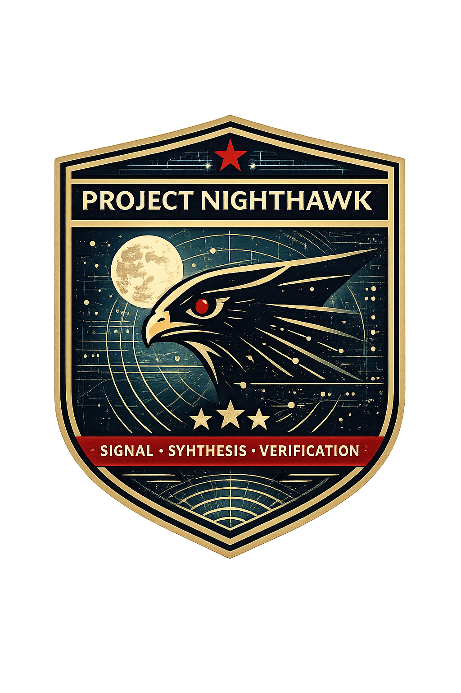

# Project-Nighthawk

<p align="center"></p>

Project Nighthawk is an AI-powered research assistant for solution engineers and cloud solution architects that generates comprehensive, fact-checked technical reports about Azure Kubernetes Service (AKS) and Azure Red Hat OpenShift (ARO).

## Features

- **Automated Research**: Searches official GitHub repositories and Microsoft Learn
- **Fact-Checked**: Every claim validated against source materials
- **Comprehensive Reports**: Markdown files with diagrams and source citations
- **Deep Technical Insights**: Implementation details from actual source code
- **Zero Installation**: Works in VS Code with GitHub Copilot

## Quick Start

```
/Nighthawk How does AKS implement KMS encryption with customer-managed keys?
```

```
/Nighthawk What are the networking options for ARO private clusters?
```

```
/Nighthawk How does AKS handle API server VNet integration with managed identity?
```

The system will automatically research, synthesize, and fact-check a complete technical report.

**See [USAGE.md](USAGE.md) for detailed guide.**

## What You Get

Each report includes:
- **Overview**: Direct answer to your question
- **Technical Deep Dive**: Implementation details from source code analysis
- **Mermaid Diagrams**: Visual explanations of complex concepts
- **Key Findings**: Summary of discoveries
- **References**: All sources cited (GitHub files, Microsoft Learn articles)
- **Fact-Check Summary**: Verification status of all claims

## Repository Structure

```
project-nighthawk/
├── .github/
│   ├── agents/                   # Agent definitions (.agent.md files)
│   │   ├── Nighthawk-Orchestrator.agent.md
│   │   ├── Nighthawk-Classifier.agent.md
│   │   ├── Nighthawk-AKS-Researcher.agent.md
│   │   ├── Nighthawk-ARO-Researcher.agent.md
│   │   ├── Nighthawk-Synthesizer.agent.md
│   │   └── Nighthawk-FactChecker.agent.md
│   ├── skills/                   # Reusable domain knowledge loaded by agents at runtime
│   │   ├── Nighthawk-LocalRepos/ # Repo paths, git pull procedure, tool checklist
│   │   └── Nighthawk-ReportTemplates/ # Report templates, Mermaid guidelines, writing rules
│   ├── prompts/                  # Shared prompt files
│   └── copilot-instructions.md  # Workspace-level Copilot instructions
├── notes/                        # Generated research reports (output)
├── repos/                        # Locally cloned source repositories (gitignored)
│   ├── AKS/
│   ├── AgentBaker/
│   ├── ARO-RP/
│   ├── azure-cli/
│   ├── azure-cli-extensions/
│   └── cloud-provider-azure/
├── assets/                       # Images and static files
├── ARCHITECTURE-DECISION-FRAMEWORK.md
├── TESTING-CHECKLIST.md
├── USAGE.md
└── README.md
```

Agent definitions live in `.github/agents/`. Skills live in `.github/skills/` and are loaded on demand at the start of each run. Generated reports land in `notes/`. The `repos/` directory holds the locally cloned source repositories that researchers search against and is not committed to source control.

## Example Reports

Check the `notes/` directory for examples of generated reports.

## Architecture

Nighthawk uses an **orchestration framework** with six specialized AI agents:

1. **Orchestrator** - Coordinates the workflow
2. **Classifier** - Determines AKS vs ARO
3. **Researchers** (AKS/ARO) - Deep source code analysis
4. **Synthesizer** - Creates comprehensive reports
5. **FactChecker** - Validates all claims

Each agent has specific tools and responsibilities, ensuring quality through staged validation.

The system implements the [Agent Handoff Pattern](https://learn.microsoft.com/en-us/azure/architecture/ai-ml/guide/ai-agent-design-patterns#agent-handoff-pattern-example) where specialized agents complete distinct tasks and pass results through well-defined contracts.

**See [.github/agents/README.md](.github/agents/README.md) for architecture details.**

## Requirements

- VS Code with GitHub Copilot
- Access to this repository
- `git` (for cloning and pulling local repos)
- [Mermaid Chart](https://marketplace.visualstudio.com/items?itemName=MermaidChart.vscode-mermaid-chart) VS Code extension (`MermaidChart.vscode-mermaid-chart`) — for rendering diagrams in generated reports

No additional installation required.

## Setup

### 1. Clone local repositories

Nighthawk researchers search locally cloned repos instead of making remote API calls, which produces more accurate, grounded results. Clone the repos once before first use:

```bash
mkdir -p repos

# ARO
git clone --depth=1 https://github.com/Azure/ARO-RP.git repos/ARO-RP
git clone --depth=1 https://github.com/Azure/azure-cli.git repos/azure-cli

# AKS (optional — only needed for AKS questions)
git clone --depth=1 https://github.com/Azure/AKS.git repos/AKS
git clone --depth=1 https://github.com/Azure/AgentBaker.git repos/AgentBaker
git clone --depth=1 https://github.com/kubernetes-sigs/cloud-provider-azure.git repos/cloud-provider-azure
git clone --depth=1 https://github.com/Azure/azure-cli-extensions.git repos/azure-cli-extensions
```

Before each research run, pull the latest:

```bash
git -C repos/ARO-RP pull --ff-only
git -C repos/azure-cli pull --ff-only
```

### 2. Enable VS Code chat tools

Nighthawk agents require specific VS Code tools to be enabled. In the chat input bar, click the **tools icon** (wrench/hammer) and enable:

| Tool | Purpose | Required |
|------|---------|----------|
| `read_file` | Read source files and reports | ✅ |
| `file_search` | Find files by name/pattern | ✅ |
| `grep_search` / Search in files | Search code across repos | ✅ |
| `replace_string_in_file` / Edit | Write reports and fact-check summaries | ✅ |
| `semantic_search` | Conceptual code search | ✅ |

> These settings persist across sessions — you only need to configure them once.

## Topics Covered

- **Azure Kubernetes Service (AKS)**
  - Node provisioning and bootstrapping
  - Networking (CNI, load balancers, routes)
  - Security (KMS, managed identity, encryption)
  - Cluster lifecycle and upgrades
  
- **Azure Red Hat OpenShift (ARO)**
  - Resource provider implementation
  - Storage accounts and managed resources
  - Operators and controllers
  - Networking and security

## Contributing

To add support for additional Azure services, create new researcher agents following the pattern in `.github/agents/`.

## License

MIT